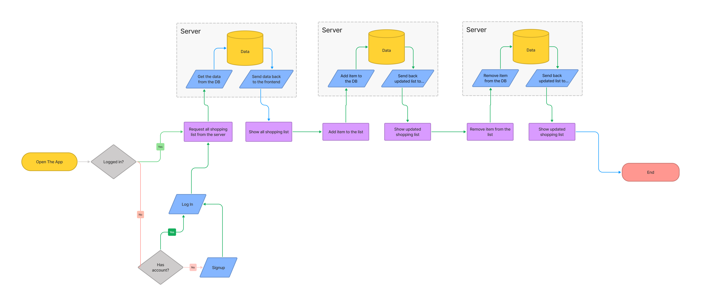

# 100HoursProject

## Main idea

Its a colaborative application make life easy and more organized for the shopping of house daily used stuffs like milk, bread, rice, sugar... etc

1. When something is missing, one of the colaborated persons in the house put the requested good in the list.
2. All collaborated persons see that list
3. Anyone go to the market take the list and delete the one he/she buy from the list
4. So there is no dublicated stuff shopped

### Above is the mvp

#### It could be more complicated by:

- Create house inventory for the stuff consumed regualrly
- Then each item has a quantity and a minimum quantity
- If the quantity reach the minimum it will be automagically ;) added to the shopping list
- So there is no missing items when needed
- Could add expiry date in the equation so when it expired automatically added to the list

### Another enhancement

It could use grographical location to remind you if you are near a preferred market location

### yet another enhacement

it could hooked with a supermaket apps that will create a shopping requirement direct from the market

